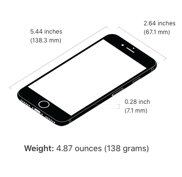
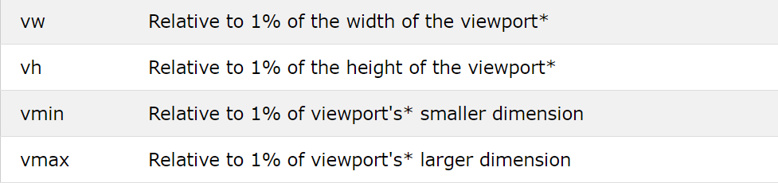
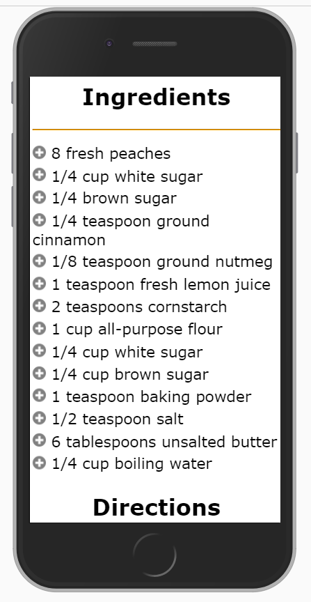
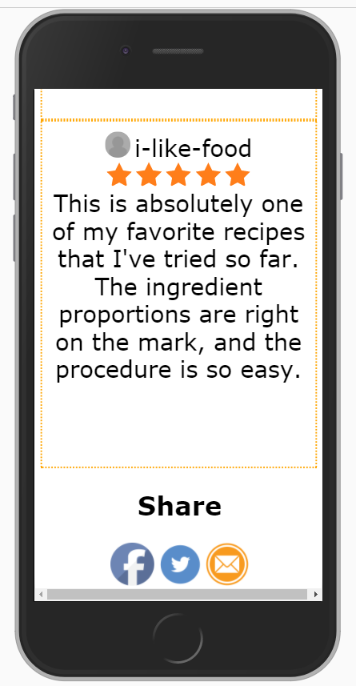

# Full Stack Web Development
## All-Recipes Lab (Flexbox Version)

In this assignment, you will be given a HTML file named "index.html" along with pictures and a video. You will apply CSS styling to this page to make it better suited for reading on the web using modern layout techniques. Just like in our ASPCA website, we are creating a simplified version of a real-life website called allrecipes.com.

## Learning Objectives:
- Practice CSS styling and selectors (color, border, images, hr, and more)
- Use flexbox for modern, flexible layouts
- Use CSS Grid as an alternative for specific layout patterns
- Use favicon icon for the first time
- Practice using pseudo classes and pseudo elements
- Create responsive websites using viewport units and media queries

Once the CSS styling is applied, your website should look *something* like the screenshots provided.

---

## Part A: HTML Setup and Desktop Styling

### HTML Preparation

Before we get started on styling our web page there are a few things we need to do!

1. **Validation**: Run index.html through the w3c validation checker. It *must pass* the w3c validation checker before you move on to the next steps.

2. **Folder structure**: Move all of your images to an appropriate "images" folder. Move the video to an appropriate "videos" folder. Now you must fix the broken links on your index.html page.

3. **Favicon**: Now, you will add a "favicon" image to your web page.

   A "favicon" is an icon associated with a URL that is displayed in a browser's address bar or next to the site name in a bookmark list.

   To add a favicon image to your site add the following text to the `<head>` section of your HTML page:

   ```html
   <link rel="icon" type="image/png" href="images/favicon.png" />
   ```

   You should see an orange logo pop up next to your web page's "title" in your browser tab.

---

### CSS Styling

Time to style our page! Be aware that only some of the essential CSS styling is listed below. Look closely at the screenshot of the page to match the website as closely as you can. Some things such as padding or margins may not be listed.

**Resources:**
- [Flexbox on MDN](https://developer.mozilla.org/en-US/docs/Learn/CSS/CSS_layout/Flexbox)
- [Flexbox on W3Schools](https://www.w3schools.com/css/css3_flexbox.asp)
- [CSS Grid on MDN](https://developer.mozilla.org/en-US/docs/Web/CSS/CSS_Grid_Layout)
- [CSS Grid on W3Schools](https://www.w3schools.com/css/css_grid.asp)

#### Body:
- Body should take up less than 100% of the screen's width
- Body content should be centered horizontally on the page
- Font of the website is "Verdana"
- Background color of the page is "#e6e6e6"

#### Main Content Container

You'll need a wrapper element around your main content to create the two-column layout for the recipe and about sections.

**Using Flexbox:**
- Create a container that holds both `#recipe` and `#about` sections
- Use `display: flex` on this container
- `#about` section should have a width (or flex-basis) of 60%
- `#recipe` section should take up the remaining space
- Add appropriate gap between columns

**HTML Structure Hint:**
```html
<div class="content-wrapper">
  <section id="recipe">...</section>
  <section id="about">...</section>
</div>
```

#### #main_content
- Background color must be white

#### Video Section

The video and its container should be positioned within the `#about` section.

**Using Flexbox:**
- The video container should have a width of 40% (or use flex-basis)
- Consider using flexbox within the `#about` section if you need to arrange multiple elements

#### Header:
- Background color is: `rgba(226, 225, 225, 0.42)`

#### Horizontal rules:
- `border-color: orange;`

---

### Ingredients List (Unordered List)

This section creates a two-column layout for the ingredient list. You have two options:

#### Option 1: Using Flexbox (Recommended for this section)

Do these steps in order to see the changes as they come!

1. Apply `display: flex` to the `<ul>` element
2. Use `flex-wrap: wrap` to allow items to wrap to the next row
3. Set each `<li>` to `flex: 0 0 50%` (don't grow, don't shrink, take 50% width)
   - This creates a two-column layout!
4. Add some `gap` or adjust padding for spacing between items

#### Option 2: Using CSS Grid (Alternative approach)

CSS Grid is actually better suited for this type of layout:

```css
ul {
  display: grid;
  grid-template-columns: repeat(2, 1fr); /* Two equal columns */
  gap: 10px; /* Space between items */
}
```

**Replacing Bullet Points with Icons:**

Now, we will replace the list item bullets with an image using a pseudo-element. We'll use the `::before` pseudo-element with a background image (this approach is more flexible for responsive design).

Add the following to your CSS:

```css
ul li::before {
  content: '';
  background-image: url('../images/plus-icon.png');
  background-size: contain;
  background-repeat: no-repeat;
  height: 20px;
  width: 20px;
  display: inline-block;
  margin-right: 8px;
}
```

**Why use background-image instead of content: url()?**
- More control over sizing with `background-size`
- Better for responsive design
- Can easily adjust with media queries

Now remove the default bullets by setting:
```css
ul {
  list-style: none;
}
```

**Hover Effect:**

When each individual ingredient is hovered over, make the background color: `rgba(255, 165, 0, 0.39)`.

**Hint:** You need to select the list items on hover. The selector would be: `ul li:hover`

---

### Save Button:

1. Resize the Save button to be larger
2. Change the background color to orange and the font color to white
3. Round out the corners and remove the border:
   ```css
   border-radius: 2%;
   border-width: 0;
   ```
4. Add a hover action using the `:hover` pseudo-class. The Save button's color should change to `rgba(255, 165, 0, 0.39)` when hovered over

**Hint:** The selector for hovering over the save button would be something like `.save-button:hover` or `#save-button:hover` depending on your HTML.

---

### Share Section:
- Images must be resized appropriately

---

### Reviews Section (#one, #two, #three)

Create a three-column layout for the reviews.

**Using Flexbox:**

1. Create a container for all reviews (might be `#reviews` or similar)
2. Apply `display: flex` to this container
3. Each review (`#one`, `#two`, `#three`) should automatically take equal space
   - Use `flex: 1` on each review to distribute space equally
   - OR set each to `flex: 0 0 33.33%` for explicit thirds
4. Add `gap` for spacing between reviews

**Additional Styling:**
- Images must be resized
- Use `border-radius: 50%` to turn images into circles
- Each individual review must have a "dotted" border style of color "orange"
- Border width should be 5px

**Example:**
```css
#reviews {
  display: flex;
  gap: 20px;
}

#one, #two, #three {
  flex: 1; /* Equal width columns */
  border: 5px dotted orange;
  /* Add padding as needed */
}

#reviews img {
  border-radius: 50%;
  /* Set appropriate width/height */
}
```

---

### Star Reviews HTML Edit:

Add a `<div>` tag with class value of "star-reviews" around each section of stars. This will bring the stars down to their own line as they will be treated as block elements.

```html
<div class="star-reviews">
  
  
  <!-- more stars -->
</div>
```

---

### #number-reviews span
- Font color should be grey

---

## Part B: Responsive Typography with Viewport Units

### Learning Objectives:
- Understand viewport units (vw, vh) and their use in responsive design
- Practice creating fluid typography

### Introduction:

Viewport units allow our text to scale relative to the browser window size, creating a more fluid and responsive design. Unlike fixed pixel values, viewport units adjust automatically as the window resizes.

At the end of Part A and without proper scaling, your website may look something like:

In order to read any of the text you would have to zoom in many times and some of the text sizing doesn't make sense: some items may look larger that h1 tags.

Not only will your webnsite be hard to read, but your "user" will likely navigate away after experiencing frustraction, resulting in potential loss of revenue or advertising sales!

Designing our website so that it is viewable on a variety of digital devices is of great importance. In 2016, the number of individual web page views on mobile devices exceeded those of individual web page views on desktop computers! Because of this, the web development community has coined the term: **mobile first design.**


### Part B1: Viewport Sizing

So far we’ve worked with pixels and percentages. There are many different ways to size content on a web page, however the most “dynamic” sizing method made available in CSS3 is “viewport sizing.” 
Viewport units are extremely powerful in responsive web design because they allow you to size your content according to the size of the current browser window. Viewport units are numerical values, where the number corresponds to (1% * the number) of the width/height of the window your website is rendering on. There will be some examples further down in this document.



**Resources:**
- [Viewport Units on MDN](https://developer.mozilla.org/en-US/docs/Web/CSS/length#viewport-percentage_lengths)
- [Responsive Typography on W3Schools](https://www.w3schools.com/css/css_rwd_intro.asp)

In general, we will mostly be using viewport units to dynamically size our text! However, viewport units can also be used to resize images + heights of our content.

**Let’s see the math…**
Let’s convert some font-sizes from pixels to viewport unit sizing:
#### Example 1: Converting font-size.
	Values: 
		Viewport width (based on most desktops): 1440px
		Current font size (default font size): 16px

	Conversion:  
    Step 1: (1440px * 0.01) * 1px;         =                 14.4px
    Step 2: (16px / 14.4px) * 1vw;           =               1.11vw 


	Therefore, 16px on a desktop is equivalent to ~1vw. 

#### Example 2: Converting image sizing.
	Values:
		Viewport width: 1440px;
		Viewport height: 800px;
		Image width: 150px;
		Image height: 250px;


	Conversion:	
		Width:
		Step 1: (1440px * .01) * 1px              =                     14.4px;
		Step 2: (150px / 14.4px) * 1vw            =                     10.42vw


		Height:
		Step 1: (800px * .01) * 1px               =                     8px;
		Step 2: (250px / 8px) * 1vh               =                     31.25vh; 

### Steps:

1. **Set Viewport Scaling**: In your `<head>` tag in your HTML file, add the line:
   ```html
   <meta name="viewport" content="width=device-width, initial-scale=1">
   ```

2. **Apply Viewport Units to Typography**:

   ```css
   /* Paragraphs */
   p {
     font-size: 1vw;
   }

   /* Headings */
   h1 {
     font-size: 2.2vw;
   }

   h2 {
     font-size: 1.66vw;
   }

   h3 {
     font-size: 1.3vw;
   }

   /* Unordered list items */
   ul li {
     font-size: 1.1vw;
   }

   /* Ordered list items */
   ol li {
     font-size: 1.1vw;
   }

   /* Save button */
   .save-button { /* or #save-button */
     font-size: 1.1vw;
   }

   /* Usernames in review section */
   .username {
     font-size: 1.66vw;
   }
   ```

3. **Resize Plus-Icon Images Responsively**:

   Update your `ul li::before` section to use viewport units:

   ```css
   ul li::before {
     content: "";
     background-image: url("../images/plus-icon.png");
     background-size: contain;
     background-repeat: no-repeat;
     height: 2vh;
     width: 2vh;
     display: inline-block;
     margin-right: 8px;
   }
   ```

---

## Part C: Styling for Mobile - Media Queries

### Learning Objectives:
- Understand media queries and how to use them to create responsive websites on any device
- Understand the importance of responsive design
- Further practice CSS styling attributes

### Introduction:

Because digital devices vary so much in size, we may need to re-prioritize the information we're giving to the user based on the available "real estate" space on the page. When designing a website, ask yourself: what are the most important portions of my page? What elements will my user interact with—are these elements large enough to be manipulated on any device?

To create the best "browsing" experience for our user, this may require us to completely re-structure our site layout based on what device the user is viewing it from.

Media queries allow us to do just that! Media queries allow us to selectively apply CSS rules to our website based on the dimension of the browser (aka viewport).

**Resources:**
- [Media Queries on MDN](https://developer.mozilla.org/en-US/docs/Web/CSS/Media_Queries/Using_media_queries)
- [Responsive Web Design - Media Queries on W3Schools](https://www.w3schools.com/css/css_rwd_mediaqueries.asp)

---

### Setting Up Media Queries

**Before you continue:**
1. Read the W3Schools Responsive Web Design – Media Queries page. Play around with the examples.

Let's make our website change its styling based on the device it's viewed on. We will create a "breakpoint" at 500px width. Below this width, our site will switch to a mobile-optimized layout.

**Note:** We first created our website with a desktop-sized screen in mind, then scaled down for mobile. However, in future projects, we will develop using "mobile first design" — designing for mobile first, then scaling up for larger screens. This is now considered best practice.

---

### Two Approaches to Organizing Mobile Styles:

#### Approach 1: Separate Stylesheet (Original Method)

1. Create a new stylesheet named **"under500.css"** and save it in your CSS folder.

2. Link this stylesheet with a media query in your HTML `<head>`:
   ```html
   <link rel="stylesheet" media="screen and (max-width:500px)" href="css/under500.css">
   ```

3. All mobile-specific styles go in this file.

#### Approach 2: Single Stylesheet with @media (Modern Best Practice)

Alternatively, add your mobile styles at the bottom of your main stylesheet:

```css
/* Your regular desktop styles above */

/* Mobile styles */
@media screen and (max-width: 500px) {
  /* All mobile-specific CSS goes here */
}
```

**Choose whichever approach you prefer.** Both are valid; the second approach is more common in modern development.

---

### Mobile Styles (for screens 500px and under)

Because screens are so much smaller on mobile compared to desktop, we need to completely change up the way our content is sized and laid out! Following the steps below. After the below styles have been applied, your website should look something like the screenshots at the end of this document.

**General Content:**
```css
* {
  text-align: center;
}

body {
  width: 100%;
}
```

---

**Header:**
```css
header img {
  height: 15vh;
  width: 100%;
}
```

---

**Typography:**
```css
h1 {
  font-size: 10vw;
}

h2 {
  font-size: 9vw;
}

h3 {
  font-size: 7vw;
}

p {
  font-size: 8vw;
}
```

---

**#recipe Section:**

On mobile, we switch from a two-column layout to single-column (stack vertically).

**Using Flexbox:**
```css
#recipe {
    display: flex;
    flex-direction: column;
    width: 100%;
}

#about-div {
  width: 100%;
}

#about img {
  width: 10vw;
}

/* If you used a flexbox container wrapper, change it to column */
#content-wrapper {
    width: 100%;
    /* Stack vertically instead of side-by-side */
}
```

---

**Save Button:**
```css
#save-button { /* or #save-button */
  width: 40vw;
  font-size: 10vw;
}
```

---

**#video-id Section:**

The video should now take full width:

```css
#video-id {
    display: flex;
    flex-direction: column;
    width: 100%;
    height: 50vh;
}
```

---

**Unordered List (Ingredients):**

Switch from two columns to single column on mobile.

**Using Flexbox:**
```css
ul li {
  flex: 0 0 100%; /* Full width - single column */
  font-size: 6vw;
  text-align: left;
}
#ingredients ul {
    padding-left: 0;
}
```

**Using CSS Grid:**
```css
ul {
  grid-template-columns: 1fr; /* Single column */
}

ul li {
  font-size: 6vw;
  text-align: left;
}
```

**Resize Plus-Icon Images:**
```css
ul li::before {
  content: '';
  background-image: url('../images/plus-icon.png');
  background-size: contain;
  background-repeat: no-repeat;
  height: 3vh;
  width: 3vh;
  display: inline-block;
  margin-right: 8px;
}
```

---

**Ordered List (Directions):**
```css
ol li {
  width: 100%; /* Full width */
  font-size: 7vw;
  text-align: left;
}
```

---

**Usernames:**
```css
.username {
  font-size: 8vw;
}
```

---

**Reviews Section:**

Switch from three columns to single column (stacked vertically).

**Using Flexbox:**
```css
#reviews {
  flex-direction: column; /* Stack vertically */
}

#reviews section { /* or #one, #two, #three */
  padding-top: 10px; /* Small padding on top */
  font-size: 4vw;
  width: 95%;
  height: 65vh;
  overflow: auto;
}

#reviews img {
  width: 5vh;
}
```

---

**Share Section:**
```css
#share img {
  width: 15vw;
  height: auto;
}
```

## Example Display







---

## Summary: Flexbox vs Float

### Why Flexbox is Better:

**Float Method (Old Way):**
- Requires clearfix hacks
- Elements can overflow containers
- Difficult to center items
- Hard to create equal-height columns
- Requires manual width calculations

**Flexbox Method (Modern Way):**
- No clearfix needed
- Items stay within containers automatically
- Easy alignment (horizontal and vertical)
- Equal-height columns by default
- Flexible sizing with `flex` property
- Easier to make responsive with `flex-direction`

### When to Use What:

- **Flexbox**: One-dimensional layouts (rows OR columns), navigation bars, card layouts, centering content
- **CSS Grid**: Two-dimensional layouts (rows AND columns), page layouts, complex grids
- **Both**: Can be combined! Use Grid for overall page structure, Flexbox for components within

---

## Testing Your Responsive Design

1. Open your page in a browser
2. Open Developer Tools (F12)
3. Click the device toolbar icon (phone/tablet icon)
4. Test different screen sizes:
   - Desktop: 1200px+
   - Tablet: 768px
   - Mobile: 375px (iPhone), 500px (breakpoint)
5. Verify layout changes appropriately at your breakpoint

---

Good luck! Remember to test your page at different browser widths to ensure your layout adapts properly between desktop and mobile views.