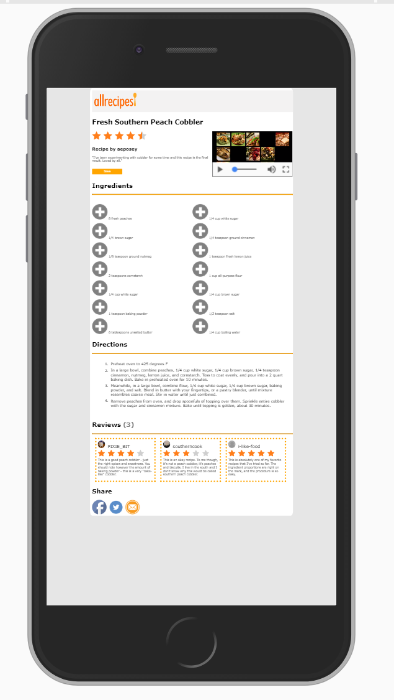
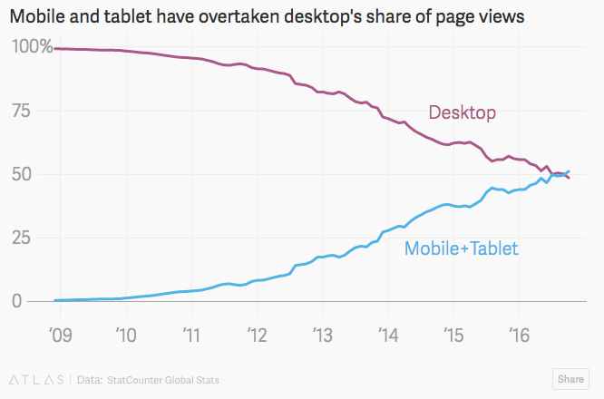
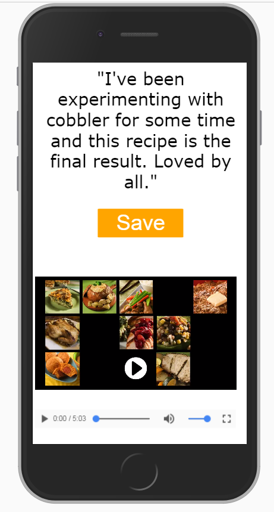
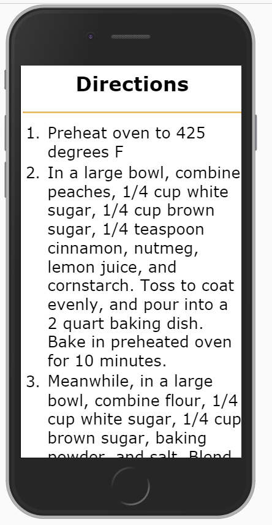
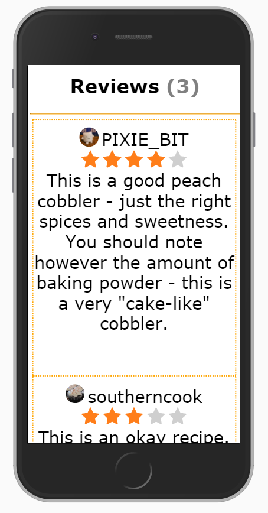

# All Recipes Peach Cobbler


## Part B: Responsive Typography with Viewport Units

### Learning Objectives:
- Understand viewport units (vw, vh) and their use in responsive design
- Practice creating fluid typography

### Introduction:

Viewport units allow our text to scale relative to the browser window size, creating a more fluid and responsive design. Unlike fixed pixel values, viewport units adjust automatically as the window resizes.

At the end of Part A and without proper scaling, your website may look something like:

In order to read any of the text you would have to zoom in many times and some of the text sizing doesn't make sense: some items may look larger that h1 tags.

Not only will your webnsite be hard to read, but your "user" will likely navigate away after experiencing frustraction, resulting in potential loss of revenue or advertising sales!

Designing our website so that it is viewable on a variety of digital devices is of great importance. In 2016, the number of individual web page views on mobile devices exceeded those of individual web page views on desktop computers! Because of this, the web development community has coined the term: **mobile first design.**




### Part B1: Viewport Sizing

So far we’ve worked with pixels and percentages. There are many different ways to size content on a web page, however the most “dynamic” sizing method made available in CSS3 is “viewport sizing.” 
Viewport units are extremely powerful in responsive web design because they allow you to size your content according to the size of the current browser window. Viewport units are numerical values, where the number corresponds to (1% * the number) of the width/height of the window your website is rendering on. There will be some examples further down in this document.


**Resources:**
- [Viewport Units on MDN](https://developer.mozilla.org/en-US/docs/Web/CSS/length#viewport-percentage_lengths)
- [Responsive Typography on W3Schools](https://www.w3schools.com/css/css_rwd_intro.asp)

In general, we will mostly be using viewport units to dynamically size our text! However, viewport units can also be used to resize images + heights of our content.

**Let’s see the math…**
Let’s convert some font-sizes from pixels to viewport unit sizing:
#### Example 1: Converting font-size.
    Values: 
        Viewport width (based on most desktops): 1440px
        Current font size (default font size): 16px

    Conversion:  
    Step 1: (1440px * 0.01) * 1px;         =                 14.4px
    Step 2: (16px / 14.4px) * 1vw;           =               1.11vw 


    Therefore, 16px on a desktop is equivalent to ~1vw. 

#### Example 2: Converting image sizing.
    Values:
        Viewport width: 1440px;
        Viewport height: 800px;
        Image width: 150px;
        Image height: 250px;


    Conversion:	
        Width:
        Step 1: (1440px * .01) * 1px              =                     14.4px;
        Step 2: (150px / 14.4px) * 1vw            =                     10.42vw


        Height:
        Step 1: (800px * .01) * 1px               =                     8px;
        Step 2: (250px / 8px) * 1vh               =                     31.25vh; 

### Steps:

1. **Set Viewport Scaling**: In your `<head>` tag in your HTML file, add the line:
   ```html
   <meta name="viewport" content="width=device-width, initial-scale=1">
   ```

2. **Apply Viewport Units to Typography**:

   ```css
   /* Paragraphs */
   p {
     font-size: 1vw;
   }

   /* Headings */
   h1 {
     font-size: 2.2vw;
   }

   h2 {
     font-size: 1.66vw;
   }

   h3 {
     font-size: 1.3vw;
   }

   /* Unordered list items */
   ul li {
     font-size: 1.1vw;
   }

   /* Ordered list items */
   ol li {
     font-size: 1.1vw;
   }

   /* Save button */
   .save-button { /* or #save-button */
     font-size: 1.1vw;
   }

   /* Usernames in review section */
   .username {
     font-size: 1.66vw;
   }
   ```

3. **Resize Plus-Icon Images Responsively**:

   Update your `ul li::before` section to use viewport units:

   ```css
   ul li::before {
     content: "";
     background-image: url("../images/plus-icon.png");
     background-size: contain;
     background-repeat: no-repeat;
     height: 2vh;
     width: 2vh;
     display: inline-block;
     margin-right: 8px;
   }
   ```

---

## Part C: Styling for Mobile - Media Queries

### Learning Objectives:
- Understand media queries and how to use them to create responsive websites on any device
- Understand the importance of responsive design
- Further practice CSS styling attributes

### Introduction:

Because digital devices vary so much in size, we may need to re-prioritize the information we're giving to the user based on the available "real estate" space on the page. When designing a website, ask yourself: what are the most important portions of my page? What elements will my user interact with—are these elements large enough to be manipulated on any device?

To create the best "browsing" experience for our user, this may require us to completely re-structure our site layout based on what device the user is viewing it from.

Media queries allow us to do just that! Media queries allow us to selectively apply CSS rules to our website based on the dimension of the browser (aka viewport).

**Resources:**
- [Media Queries on MDN](https://developer.mozilla.org/en-US/docs/Web/CSS/Media_Queries/Using_media_queries)
- [Responsive Web Design - Media Queries on W3Schools](https://www.w3schools.com/css/css_rwd_mediaqueries.asp)

---

### Setting Up Media Queries

**Before you continue:**
1. Read the W3Schools Responsive Web Design – Media Queries page. Play around with the examples.

Let's make our website change its styling based on the device it's viewed on. We will create a "breakpoint" at 500px width. Below this width, our site will switch to a mobile-optimized layout.

**Note:** We first created our website with a desktop-sized screen in mind, then scaled down for mobile. However, in future projects, we will develop using "mobile first design" — designing for mobile first, then scaling up for larger screens. This is now considered best practice.

---

### Two Approaches to Organizing Mobile Styles:

#### Approach 1: Separate Stylesheet (Original Method)

1. Create a new stylesheet named **"under500.css"** and save it in your CSS folder.

2. Link this stylesheet with a media query in your HTML `<head>`:
   ```html
   <link rel="stylesheet" media="screen and (max-width:500px)" href="css/under500.css">
   ```

3. All mobile-specific styles go in this file.

#### Approach 2: Single Stylesheet with @media (Modern Best Practice)

Alternatively, add your mobile styles at the bottom of your main stylesheet:

```css
/* Your regular desktop styles above */

/* Mobile styles */
@media screen and (max-width: 500px) {
  /* All mobile-specific CSS goes here */
}
```

**Choose whichever approach you prefer.** Both are valid; the second approach is more common in modern development.

---

### Mobile Styles (for screens 500px and under)

Because screens are so much smaller on mobile compared to desktop, we need to completely change up the way our content is sized and laid out! Following the steps below. After the below styles have been applied, your website should look something like the screenshots at the end of this document.

**General Content:**
```css
* {
  text-align: center;
}

body {
  width: 100%;
}
```

---

**Header:**
```css
header img {
  height: 15vh;
  width: 100%;
}
```

---

**Typography:**
```css
h1 {
  font-size: 10vw;
}

h2 {
  font-size: 9vw;
}

h3 {
  font-size: 7vw;
}

p {
  font-size: 8vw;
}
```

---

**#recipe Section:**

On mobile, we switch from a two-column layout to single-column (stack vertically).

**Using Flexbox:**
```css
#recipe {
    display: flex;
    flex-direction: column;
    width: 100%;
}

#about-div {
  width: 100%;
}

#about img {
  width: 10vw;
}

/* If you used a flexbox container wrapper, change it to column */
#content-wrapper {
    width: 100%;
    /* Stack vertically instead of side-by-side */
}
```

---

**Save Button:**
```css
#save-button { /* or #save-button */
  width: 40vw;
  font-size: 10vw;
}
```

---

**#video-id Section:**

The video should now take full width:

```css
#video-id {
    display: flex;
    flex-direction: column;
    width: 100%;
    height: 50vh;
}
```

---

**Unordered List (Ingredients):**

Switch from two columns to single column on mobile.

**Using Flexbox:**
```css
ul li {
  flex: 0 0 100%; /* Full width - single column */
  font-size: 6vw;
  text-align: left;
}
#ingredients ul {
    padding-left: 0;
}
```

**Using CSS Grid:**
```css
ul {
  grid-template-columns: 1fr; /* Single column */
}

ul li {
  font-size: 6vw;
  text-align: left;
}
```

**Resize Plus-Icon Images:**
```css
ul li::before {
  content: '';
  background-image: url('../images/plus-icon.png');
  background-size: contain;
  background-repeat: no-repeat;
  height: 3vh;
  width: 3vh;
  display: inline-block;
  margin-right: 8px;
}
```

---

**Ordered List (Directions):**
```css
ol li {
  width: 100%; /* Full width */
  font-size: 7vw;
  text-align: left;
}
```

---

**Usernames:**
```css
.username {
  font-size: 8vw;
}
```

---

**Reviews Section:**

Switch from three columns to single column (stacked vertically).

**Using Flexbox:**
```css
#reviews {
  flex-direction: column; /* Stack vertically */
}

#reviews section { /* or #one, #two, #three */
  padding-top: 10px; /* Small padding on top */
  font-size: 4vw;
  width: 95%;
  height: 65vh;
  overflow: auto;
}

#reviews img {
  width: 5vh;
}
```

---

**Share Section:**
```css
#share img {
  width: 15vw;
  height: auto;
}
```

## Example Display








---

## Summary: Flexbox vs Float

### Why Flexbox is Better:

**Float Method (Old Way):**
- Requires clearfix hacks
- Elements can overflow containers
- Difficult to center items
- Hard to create equal-height columns
- Requires manual width calculations

**Flexbox Method (Modern Way):**
- No clearfix needed
- Items stay within containers automatically
- Easy alignment (horizontal and vertical)
- Equal-height columns by default
- Flexible sizing with `flex` property
- Easier to make responsive with `flex-direction`

### When to Use What:

- **Flexbox**: One-dimensional layouts (rows OR columns), navigation bars, card layouts, centering content
- **CSS Grid**: Two-dimensional layouts (rows AND columns), page layouts, complex grids
- **Both**: Can be combined! Use Grid for overall page structure, Flexbox for components within

---

## Testing Your Responsive Design

1. Open your page in a browser
2. Open Developer Tools (F12)
3. Click the device toolbar icon (phone/tablet icon)
4. Test different screen sizes:
   - Desktop: 1200px+
   - Tablet: 768px
   - Mobile: 375px (iPhone), 500px (breakpoint)
5. Verify layout changes appropriately at your breakpoint

---

Good luck! Remember to test your page at different browser widths to ensure your layout adapts properly between desktop and mobile views.