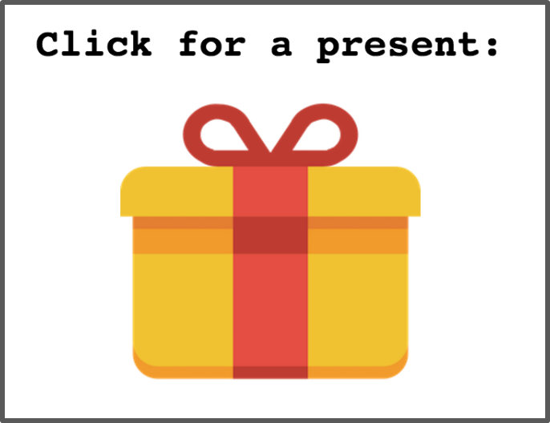

# Events

## Click for a Present

Let's give us a present.
After receiving the present (click event), let's show our thanks


**`event.target`** — the element that **triggered** the event (where the click/action actually happened).

**`event.currentTarget`** — the element that **has the listener attached** (always the element you called `addEventListener` on).

They differ when you use **event delegation**:

```js
document.querySelector('ul').addEventListener('click', (e) => {
  console.log(e.target);        // <li> that was clicked
  console.log(e.currentTarget); // <ul> (has the listener)
});
```

**Same element** — only when you click directly on the element with the listener (no bubbling involved).

**Quick rule:** `target` = origin, `currentTarget` = listener owner.

## It would be nice to change the text after present is opened


