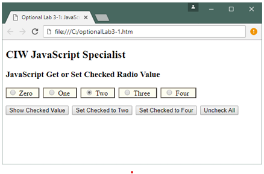
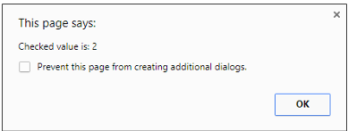

# Week 2
## Original name:
Optional Lab 3-1 : JavaScript Functions
In this optional lab, you will run a program that uses JavaScript functions and 
arguments. Functions in JavaScript can receive a varying number of arguments. Also, 
explicit placeholders need not be defined in the function signature to use these 
arguments.

Examine the code for a form. 


## Comments
```html
<!DOCTYPE html>
<html lang="en">
<head>
  <meta charset="utf-8">
  <title>Optional Lab 3-1: JavaScript Functions</title>
  <style>
    label {
      background-color: #FDFDF0;
      color: black;
      border: 2px outset #8B8378;
      padding: 0.1em 2ex 0.1em 0.5ex;
      line-height: 1.6em;
    }
  </style>
</head>
<body>
  <h2>CIW JavaScript Specialist</h2>
  <h3>JavaScript Get or Set Checked Radio Value</h3>

  <form id="radioExampleForm">
    <p>
      <label for="number0"><input type="radio" value="0" name="number" id="number0"> Zero</label>
      &nbsp;<label for="number1"><input type="radio" value="1" name="number" id="number1"> One</label>
      &nbsp;<label for="number2"><input type="radio" value="2" name="number" id="number2"> Two</label>
      &nbsp;<label for="number3"><input type="radio" value="3" name="number" id="number3"> Three</label>
      &nbsp;<label for="number4"><input type="radio" value="4" name="number" id="number4"> Four</label>
    </p>
    <p>
      <button type="button" id="showBtn">Show Checked Value</button>
      &nbsp;<button type="button" id="setTwoBtn">Set Checked to Two</button>
      &nbsp;<button type="button" id="setFourBtn">Set Checked to Four</button>
      &nbsp;<button type="button" id="uncheckBtn">Uncheck All</button>
    </p>
  </form>

  <script>
    // Returns the value of the currently checked radio button.
    // querySelectorAll returns a NodeList — we search it for the checked input.
    // Returns empty string if nothing is checked.
    function getCheckedValue(name) {
      const checked = document.querySelector(`input[name="${name}"]:checked`);
      return checked ? checked.value : "";
    }

    // Checks the radio button matching newValue.
    // Passing an empty string or a non-existent value unchecks all.
    function setCheckedValue(name, newValue) {
      document.querySelectorAll(`input[name="${name}"]`).forEach(radio => {
        radio.checked = (radio.value === newValue);
      });
    }

    document.addEventListener('DOMContentLoaded', () => {
      document.getElementById("showBtn").addEventListener('click', () => {
        alert("Checked value is: " + getCheckedValue("number"));
      });

      document.getElementById("setTwoBtn").addEventListener('click', () => {
        setCheckedValue("number", "2");
      });

      document.getElementById("setFourBtn").addEventListener('click', () => {
        setCheckedValue("number", "4");
      });

      document.getElementById("uncheckBtn").addEventListener('click', () => {
        setCheckedValue("number", ""); // no match → all unchecked
      });
    });
  </script>
</body>
</html>
```
## Step 2
Browser: Open the file OptionalLab3-1.htm. You will see the form shown in Figure 
OL3-1.  
 
## Step 3
Browser: Study the form. It contains five radio buttons and four buttons, each with a 
different purpose, which gets passed to the function. Depending on the radio button 
checked, it will return the value after it has been passed through the function. If
there is no input (no radio buttons checked), then the form will gracefully pass a 
blank. This process is called validation: Every choice offered to a user is handled and 
returned through the program, even if the input is wrong. Gracefully handling 
validation is an important part of scripting. 
## Step 4
Browser: Select one of the number values, then click the Show Checked Value 
button. You will see an alert that shows the value of the radio button you selected, as 
shown in Figure OL3-2. If you do not select a value radio button, the alert will show 
blank. The other buttons can select a value for the user, or clear the radio buttons. 
Figure OL3-2: Alert showing checked value 
In this lab, you ran a program that uses JavaScript functions and arguments. This 
example shows how to pass values through a function in a very simple, yet engaging 
manner. Functions in JavaScript can receive a varying number of arguments. Also, 
explicit placeholders need not be defined in the function signature to use these 
arguments.
---

Key changes beyond the usual:

- **`getCheckedValue` rewritten** — the original manually handled the edge case of a single radio button (`radioLength == undefined`) because `document.forms[].elements[]` returns a single element instead of an array when there's only one. `querySelector` with `:checked` eliminates that entirely — one line replaces the whole function
- **`setCheckedValue` rewritten** — `querySelectorAll` always returns a NodeList regardless of count, so the single-element edge case disappears again; `forEach` replaces the manual loop
- Both functions now take a **name string** instead of a DOM collection — cleaner interface, no need to pass `document.forms[].elements[]` from the caller
- `<!-- -->` wrappers removed from both `<script>` and `<style>` — both are obsolete
- `type="text/css"` removed from `<style>`
- `xmlns` XHTML attribute removed
- `method="get" action="" onsubmit="return false;"` removed — unnecessary since buttons are `type="button"`, not `type="submit"`
- Missing `<body>` tag added — original had `</body>` but no opening tag

**Still valid, rarely recommended.** It's part of the HTML spec and browsers support it, but `getElementById`/`querySelector` have largely replaced it.

---

**The three ways to access form inputs:**

```js
// 1. document.forms — old, spec-valid, fragile
document.forms['radioExampleForm'].elements['number']
document.forms[0].elements[0]  // positional — breaks if form order changes

// 2. getElementById — direct, reliable, most common
document.getElementById('number2')

// 3. querySelector — most flexible, CSS selector syntax
document.querySelector('input[name="number"]:checked')
document.querySelectorAll('input[name="number"]')
```

---

**Why `document.forms[]` is problematic:**

| Issue | Detail |
|---|---|
| Requires `name` attribute | `id` alone is not enough |
| Positional access `forms[0]` | breaks if another form is added to the page |
| Verbose | `document.forms['myForm'].elements['myField']` vs `getElementById('myField')` |
| Single element edge case | returns one element or a collection depending on count — as seen in the original lab |

---

**When it still makes sense:**

```js
// Iterating ALL fields in a form — FormData is better, but this works
const form   = document.forms['myForm'];
const fields = form.elements;
for (const field of fields) {
  console.log(field.name, field.value);
}

// OR the modern equivalent
const data = new FormData(document.getElementById('myForm'));
for (const [key, value] of data) {
  console.log(key, value);
}
```

---

> **Rule of thumb:** use `getElementById` for single known fields, `querySelectorAll` for groups (like radio buttons), and `FormData` when you need all fields at once. `document.forms[]` is the legacy path — know it to read old code, don't reach for it in new code.

