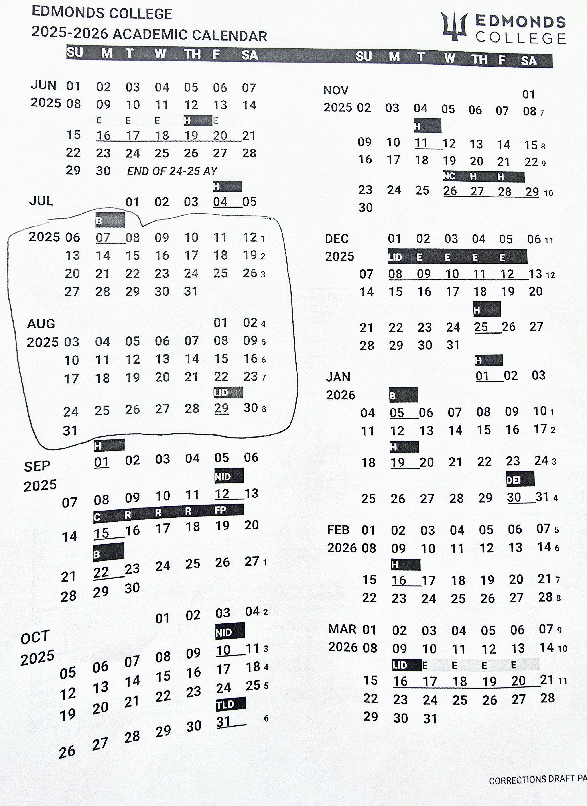

# README.md

## 7.12.2025
1. 
1. C:\Users\localepsilon\Documents\__REPO\react.dev : github repo, node_modules compressed as 7z
1. C:\Users\localepsilon\Documents\AFTER_IMAGE\2025\vite-react-july-app : tic-tac-toe tutorial
1. C:\Users\localepsilon\Documents\AFTER_IMAGE\2025\how-to-create-vite-react-app.docx
1. from gcfglobal.org
    1. https://edu.gcfglobal.org/en/internetbasics/ add tutorial.html
    1. https://edu.gcfglobal.org/en/internet-tips/
    1. https://edu.gcfglobal.org/en/search-better-2018/
    1. https://edu.gcfglobal.org/en/techsavvy/
    1. https://edu.gcfglobal.org/en/prezi/
1. Repo books by Flavio Copes
    1. astro-handbook.pdf
    1. express-handbook.pdf
    1. git-cheat-sheet.pdf
    1. go-handbook.pdf
    1. linux-commands-handbook.pdf
    1. nextjs-pages-router-handbook.pdf
    1. python-handbook.pdf
    1. react-handbook.pdf
    1. typescript-handbook.pdf
1. Week 2
    1. 1A-How the Internet works.docx
    1. 1B-How the Web works.docx
    1. 1C-What is a browser and how it works.docx
    1. 1D-What is a URL.docx
    1. 1E-The IP protocol.docx
    1. 1F-IP Address.docx
    1. 1G-The HTTP Protocol.docx
    1. 1H-An HTTP request.docx
    1. 1I-HTTP status codes.docx
    1. 1J-HTTP Client.docx
    1. 1K-HTTP Request Headers.docx
    1. 1L-HTTP Response Headers.docx
    1. 1M-HTTPS.docx
    1. 1P-Recommended extensions.docx
    1. 1Z-PRACTICE.docx
1. http://localhost:22022/websites/developer.mozilla.org/en-US/docs/Learn_web_development/Getting_started/Web_standards/How_the_web_works.html
1. https://developer.mozilla.org/en-US/docs/Learn_web_development/Getting_started/Web_standards/How_the_web_works
    1. 
    1. clients and servers
    1. The other parts of the toolbox: TCP/IP, DNS, HTTP, Files.
    1. So what happens, exactly?
    1. DNS, packets explained
    1. HTTP basics
    1. Status codes
    1. Components of URL
    1. How the internet works: https://developer.mozilla.org/en-US/docs/Learn_web_development/Howto/Web_mechanics/How_does_the_Internet_work
    1. 
1. https://developer.mozilla.org/en-US/docs/Learn_web_development
    1. The essential skill for new frontend developer
    1. Getting started modules
    1. Core modules
    1. Extension modules
    1. The frontend developer path with partner Scrimba
    1. Codeacademy, freeCodeCamp, Learn JavaScript
1. https://developer.mozilla.org/en-US/docs/Learn_web_development/Getting_started/Web_standards/The_web_standards_model
    1. http://localhost:22022/websites/developer.mozilla.org/en-US/docs/Learn_web_development/Getting_started/Web_standards/The_web_standards_model.html
    1. Brief history of the web
    1. Web standards
    1. Overview of modern web technologies
    1. Tools
    1. Server-side languages and frameworks
    1. static vs dynamic
    1. Web best practices: progressive enhancement, cross-browser compatibility, separating layers, responsive web design, performance, internationalization, privacy and security
1. https://developer.mozilla.org/en-US/docs/Learn_web_development/Getting_started/Web_standards/How_browsers_load_websites
    1. Http response: what files are returned?
    1. Web page rendering
    1. Handling HTML
    1. Parsing CSS and rendering the page
    1. 
    1. Handling JavaScript
    1. The browser: a hostile and an awesome programming environment.
1. https://developer.mozilla.org/en-US/docs/Learn_web_development/Howto/Solve_HTML_problems
1. http://localhost:22022/websites/developer.mozilla.org/en-US/docs/Learn_web_development/Howto/Solve_JavaScript_problems.html
1. https://developer.mozilla.org/en-US/curriculum/core/javascript-fundamentals/
1. http://localhost:22022/websites/developer.mozilla.org/en-US/curriculum/core/javascript-fundamentals/index.html
1. http://localhost:22022/websites/developer.mozilla.org/en-US/curriculum/core/javascript-fundamentals/index.html
1. http://localhost:22022/websites/developer.mozilla.org/en-US/curriculum/core/design-for-developers/index.html
1. http://localhost:22022/websites/developer.mozilla.org/en-US/docs/Learn_web_development/Core/Version_control.html
1. http://localhost:22022/websites/developer.mozilla.org/en-US/curriculum/index.html
1. http://localhost:22022/websites/developer.mozilla.org/en-US/curriculum/core/
1. https://developer.mozilla.org/en-US/docs/Learn_web_development/Getting_started/Web_standards/How_browsers_load_websites
1. 

## 7.19.2025; electron
1. https://github.com/electron/forge/issues/1592
1. 