# cis244-246/recipe-app-2025/frontend

## tree
~~~
│   .gitignore
│   eslint.config.js
│   index.html
│   package-lock.json
│   package.json
│   README.md
│   vite.config.js
│
├───public
│       vite.svg
│
└───src
    │   App.css
    │   App.jsx
    │   index.css
    │   main.jsx
    │
    └───assets
            react.svg

~~~
## package.json
```js
{
  "name": "frontend-vite-2025",
  "private": true,
  "version": "0.0.0",
  "type": "module",
  "scripts": {
    "dev": "vite",
    "build": "vite build",
    "lint": "eslint .",
    "preview": "vite preview"
  },
  "dependencies": {
    "react": "^19.1.0",
    "react-dom": "^19.1.0"
  },
  "devDependencies": {
    "@eslint/js": "^9.25.0",
    "@types/react": "^19.1.2",
    "@types/react-dom": "^19.1.2",
    "@vitejs/plugin-react": "^4.4.1",
    "eslint": "^9.25.0",
    "eslint-plugin-react-hooks": "^5.2.0",
    "eslint-plugin-react-refresh": "^0.4.19",
    "globals": "^16.0.0",
    "vite": "^6.3.5"
  }
}
```
## Steps

### Step-j createRecipe POST fetch
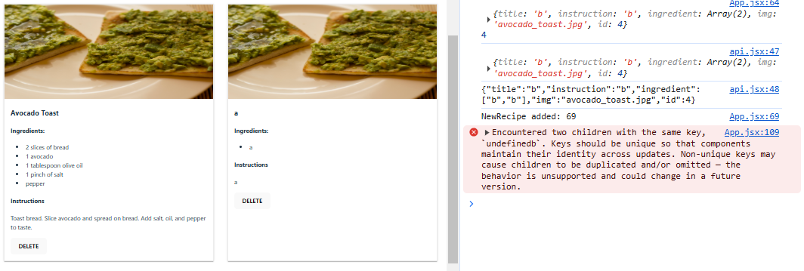


### Step-1h loadRecipe from mongoDb with duplicate key
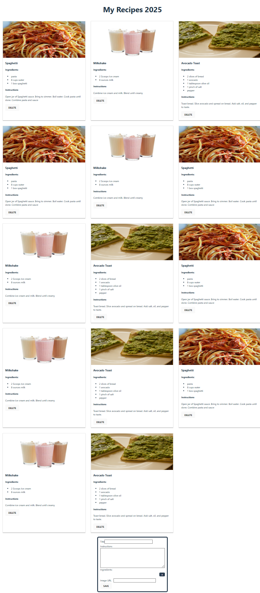
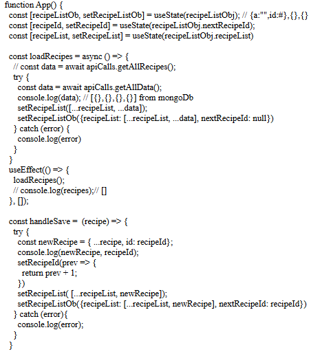

### Step 1g: backend done, frontend api.jsx created
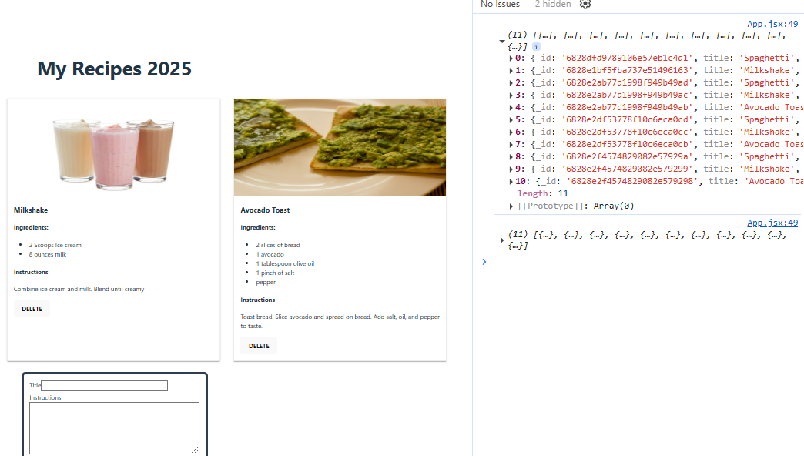


### Step 1d - Recipes Local Array
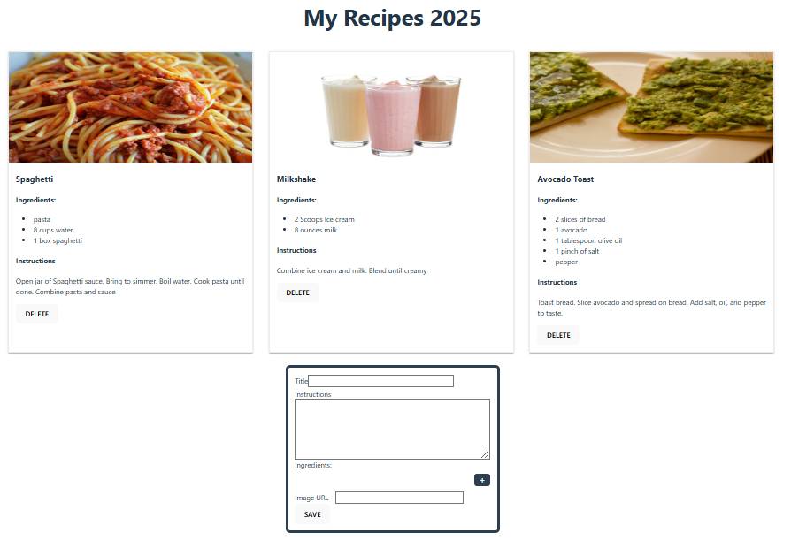
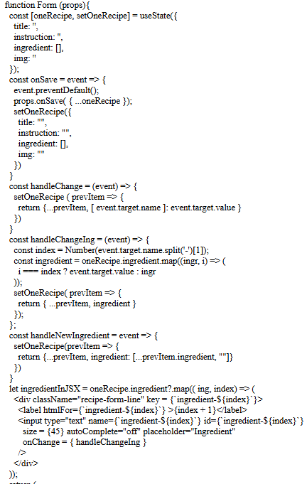
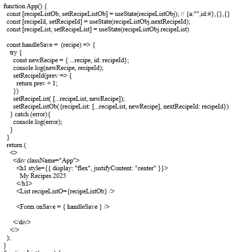

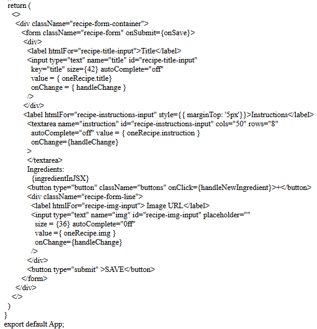

### Step 1c : Form, no values assigned

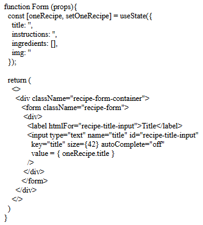
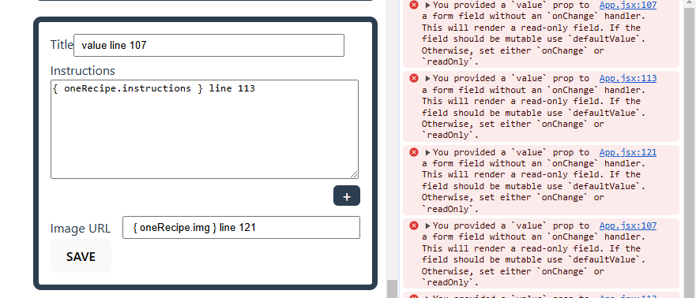

### Step 1a
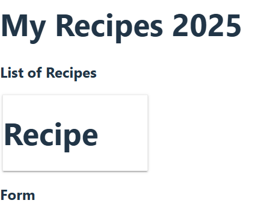
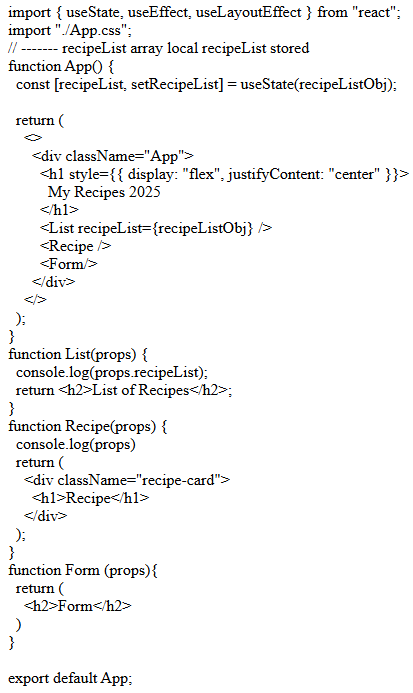

### Step 1b
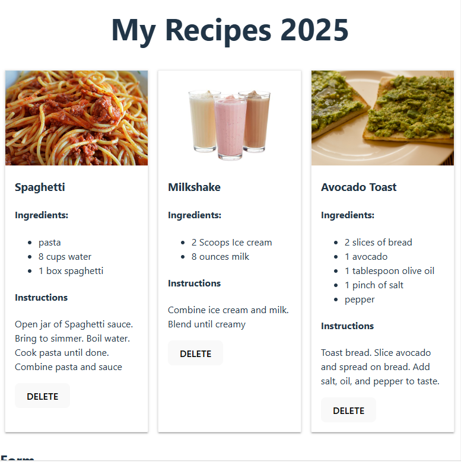
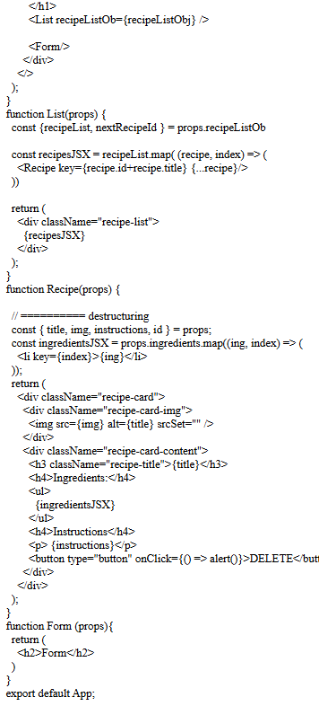


# React + Vite

This template provides a minimal setup to get React working in Vite with HMR and some ESLint rules.

Currently, two official plugins are available:

- [@vitejs/plugin-react](https://github.com/vitejs/vite-plugin-react/blob/main/packages/plugin-react) uses [Babel](https://babeljs.io/) for Fast Refresh
- [@vitejs/plugin-react-swc](https://github.com/vitejs/vite-plugin-react/blob/main/packages/plugin-react-swc) uses [SWC](https://swc.rs/) for Fast Refresh

## Expanding the ESLint configuration

If you are developing a production application, we recommend using TypeScript with type-aware lint rules enabled. Check out the [TS template](https://github.com/vitejs/vite/tree/main/packages/create-vite/template-react-ts) for information on how to integrate TypeScript and [`typescript-eslint`](https://typescript-eslint.io) in your project.
