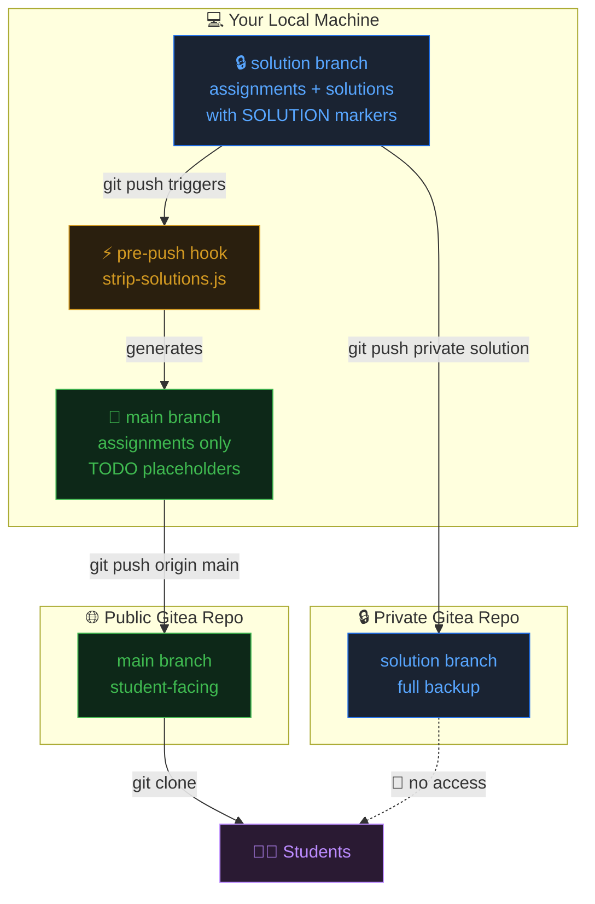

# Course Assignments — Two-Remote Workflow

## How It Works

The `solution` branch is the single source of truth. A pre-push hook automatically strips solution code and syncs the clean version to `main`, which is the only branch students see.



## Setup

### 1. Add remotes

```bash
# Private remote (your full solution backup)
git remote add private git@your-gitea:you/course-solutions.git

# Public remote (students clone this)
git remote add origin git@your-gitea:you/course-public.git
```

### 2. Install the hook

```bash
npm run setup:hooks
```

### 3. Daily workflow

```bash
git checkout solution
# edit files, add assignments with solution markers
git add -A && git commit -m "Week 3: arrays assignment"
git push private solution   # backs up full code + triggers hook → pushes main to origin
```

## Solution Markers

Use language-specific comment markers in your source files:

**JS / JSX / TS / TSX**
```js
function solve(items) {
  // === SOLUTION START ===
  return items.reduce((sum, item) => sum + item.price, 0);
  // === SOLUTION END ===
}
```

**CSS / SCSS**
```css
.container {
  /* === SOLUTION START === */
  display: grid;
  grid-template-columns: repeat(3, 1fr);
  /* === SOLUTION END === */
}
```

**HTML / SVG**
```html
<div id="app">
  <!-- === SOLUTION START === -->
  <h1>Hello World</h1>
  <!-- === SOLUTION END === -->
</div>
```

## npm Scripts

| Command | Description |
|---|---|
| `npm run build:student` | Generate stripped files in `./student-dist/` |
| `npm run build:student:blank` | Same but leaves blank instead of TODO |
| `npm run build:student:preview` | Dry run — shows what would be stripped |
| `npm run setup:hooks` | Install the pre-push Git hook |
