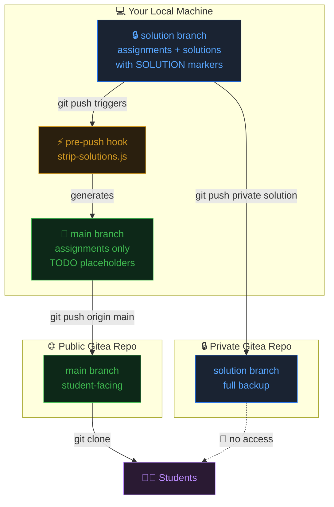

```mermaid
graph TD
    subgraph LOCAL["💻 Your Local Machine"]
        SOL["🔒 solution branch<br/>assignments + solutions<br/>with SOLUTION markers"]
        HOOK["⚡ pre-push hook<br/>strip-solutions.js"]
        MAIN["📂 main branch<br/>assignments only<br/>TODO placeholders"]
        SOL -->|"git push triggers"| HOOK
        HOOK -->|"generates"| MAIN
    end

    subgraph PRIVATE["🔒 Private Gitea Repo"]
        PRSOL["solution branch<br/>full backup"]
    end

    subgraph PUBLIC["🌐 Public Gitea Repo"]
        PUBMAIN["main branch<br/>student-facing"]
    end

    SOL -->|"git push private solution"| PRSOL
    MAIN -->|"git push origin main"| PUBMAIN
    PUBMAIN -->|"git clone"| STUDENTS["👩‍🎓 Students"]
    PRSOL -.->|"🚫 no access"| STUDENTS

    style SOL fill:#1a2332,stroke:#1f6feb,color:#58a6ff
    style HOOK fill:#2a1f0e,stroke:#d29922,color:#d29922
    style MAIN fill:#0d2818,stroke:#3fb950,color:#3fb950
    style PRSOL fill:#1a2332,stroke:#1f6feb,color:#58a6ff
    style PUBMAIN fill:#0d2818,stroke:#3fb950,color:#3fb950
    style STUDENTS fill:#2a1a33,stroke:#bc8cff,color:#bc8cff
```