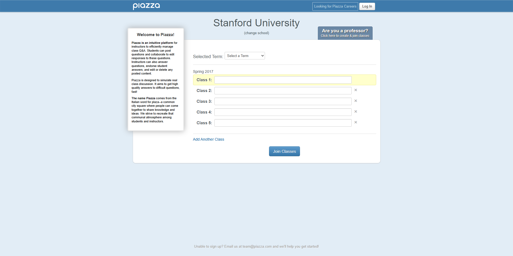

# Computer Science Courses

1. [CS193X Spring 2023](https://web.stanford.edu/class/cs193x/lectures.html)
    1. [final-project](https://web.stanford.edu/class/cs193x/project/)
    1. [Intro to JavaScript](https://web.stanford.edu/class/cs193x/lectures/02/02-slides.pdf)
    1. [Assignment 3.1](https://web.stanford.edu/class/cs193x/assign3.1/)
1. CS193X: Spring 2017
    1. [Syllabus](https://web.stanford.edu/class/archive/cs/cs193x/cs193x.1176/syllabus/)
    1. [Course Staff](https://web.stanford.edu/class/archive/cs/cs193x/cs193x.1176/staff/)
    1. [Info](https://web.stanford.edu/class/archive/cs/cs193x/cs193x.1176/info/)
    1. https://web.stanford.edu/class/archive/cs/cs193x/cs193x.1176/
    1. Victoria Kirst, instructor (vrk@)
    1. Amy Xu, TA (xuamyj@)
    1. Cindy Lin, TA (cinlin@)
    1. Helen Fang, TA (hfang9@)
    1. Zach Maurer, TA (zmaurer@)
    1. [homework](https://web.stanford.edu/class/archive/cs/cs193x/cs193x.1176/homework/)
1. [CS106B Programming Abstractions](https://web.stanford.edu/class/cs106b/)
1. [cs193x-2018-homework-0](https://web.stanford.edu/class/archive/cs/cs193x/cs193x.1176/homework/0-welcome)
1. 