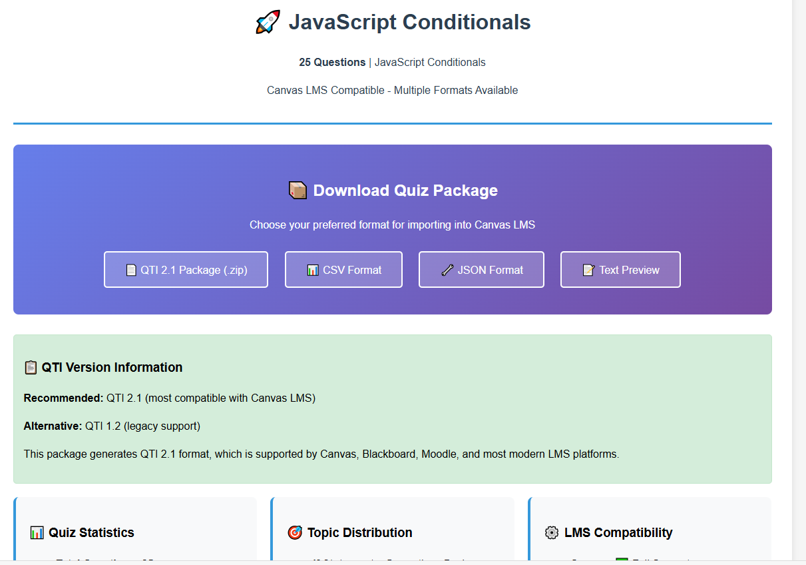
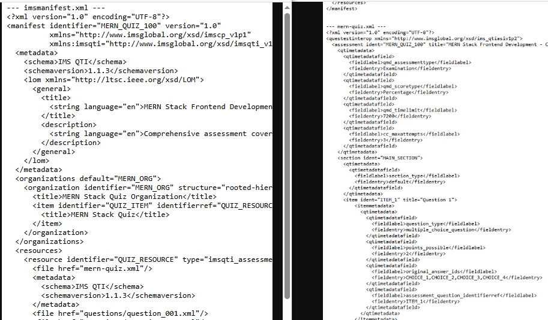

# HTML QTI generator

1. add questions on json format:
```js or json
  {
          id: 4024,
          type: "multiple_choice",
          category: "Ternary Operator",
          difficulty: "advanced",
          question: "What is the equivalent if-else for this ternary?",
          code: `let message = isLoggedIn ? 
  (isAdmin ? 'Admin Dashboard' : 'User Dashboard') : 
  'Please Login';`,
          options: [
            "Single if-else statement",
            "if-else if-else statement",
            "Nested if-else statements",
            "Switch statement"
          ],
          correct_answer: 2,
          explanation: "This nested ternary is equivalent to: if (isLoggedIn) { if (isAdmin) return 'Admin Dashboard'; else return 'User Dashboard'; } else { return 'Please Login'; }",
          points: 4
        }
```
1. Run the html file
1. select "Download quiz package QTI 2.1" which actually does not generate the package, it generate one file.
1. create a folder with correct name depending on the topic and questions
1. copy the generated file twice: change name to imsmanifest.xml and the other to mern-quiz.xml 
1. compress the folder and upload to canvas as qti
1. It saves the questions a quiz and as question bank as well.